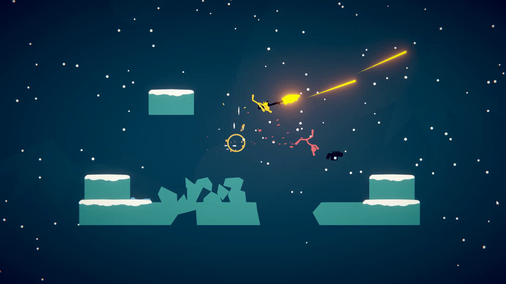

# Basic Proposal for NEA
## Outline

I want to create a game in python (or maybe c++ as I'm not fully decided on what to use) using a module like pygame (need to research what is best for what I am designing). It will be a local multiplayer platformer / shooter with destructible enviroments. There will be two game modes: VS were players fight against each other and coop where players fight against enemies which use path finding algorithms to get to the player (the coop gamemode would be a later adition as it requires more work). The game will work similarly to stick fight where platforms break into peices when shot.

This will work by creating movable Objects in the position of the non-movable Object when shot. These non-movable Objects will interact with each other by colliding of each other an the enviroment. 

Most of the algorithmic complexity of the game will come from the physics and the path finding where the enemies will need to find the best path over broken platforms on the ground.

