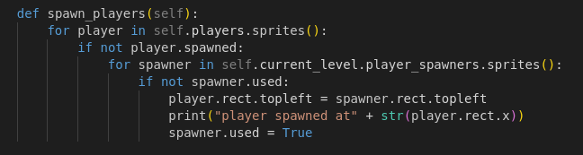
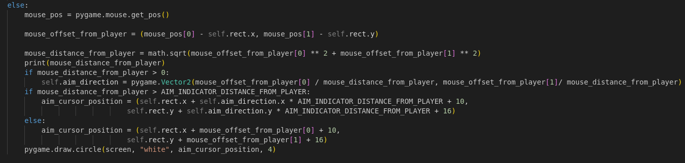
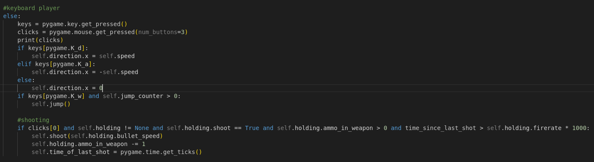
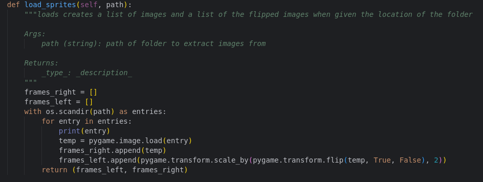
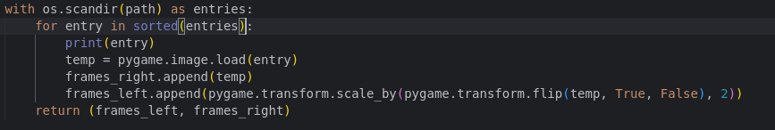
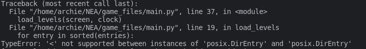
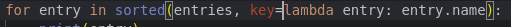

# Notebook

## Analysis

Researched different python modules to use for game development: [here](https://geekflare.com/python-game-development-libraries-frameworks/)

Best options were:

* Pygame
  
  * lots of other people using it
  * fast

* Python Arcade
  
  * Works well with PyInstaller to make executables

## Exploritory work

Created a class for a basic rigid body which has attributes as numpy arrays which work like vectors (the maths vectors). 2 methods which add a force to the object and one to update the attributed of the object.


Created a basic python game loop:


made an object with a mass and a position:


Here you can see that the object called ball is being drawn to the screen:


It does not move as no forces are acting on it.

I created a class called player which I will use later


thinking of doing levels with a level map string after looking at a [video](https://www.youtube.com/watch?v=YWN8GcmJ-jA)


```python
class Level():
  def __init__(self, level, level_ID):
    self.level = level
    self.level_ID = level_ID

level1 = Level([
      "      ",
      "XX  XX",
      "XXXXXX"
    ], 23)
```

will run a function that gets all levels from a file that comes with the game. This can be added or removed from.

when a level is being played the level can be changed by destroying tiles. this will not effect the levels that are stored in the file.

created a class for the level and for the tiles both from the above tutorial video


I created a test tile and drew it


here is the result


created a method that runs when the object is created


It adds a tile to a group of sprites if there is an "X" in the level layout in that position. 


Error that amkes no sense - Error was boring missed a parenthesis


After some slow debugging I finally got the map to display properly to make this. wow.


created a levels folder which has some txt files in it storing some simple levels. Also made a test python file which goes through the files in this folder and gets the laevel layouts from each and creates a python list to sort which will be used to create a Level object.


result:


I implemented the same code as a function with a small change where it appends a Level object to the levels list


made some collision logic and now I have a player that can walk on the tiles, jump and interact with the world


movement is currently very fast and unnatural but that will be changed in later versions by using acceleration and decceleration by friction which will make the movement feel more natural. Also movement currently uses the "wasd" keys which is not my favourite method as I would like to use controllers as it is a better method for local multiplayer. I also need to guns and deaths and multiplayer.

 added a weapon parent class for use later.

I also added some images to the game such as a background image that is rendered before all other items, tile images and player images. The tile player images were being blited to the surface which resulted in black areas where there should be alpha. 


I fixed this by rendering blitting the image with the alpha to the screen instead


Added controllers which will be the primary method of playing the game.


I added circles to show where the players are aiming with the right joystick of a controller. These circles just show the position of the right joystick (a  tuple of two floats between -1 and 1 representing the position of the joystick) times by a constant.

Here is the code that does that.


this code uses the top left of the player as the centre of the aiming circle which doesnt look right so I changed it by adding half the width and half the hight of the player onto the position of the circle. 

 

Also another problem is that depending on the where the player is aiming the speed of the bullets will differ. This results in some bullets being slower than others by large amounts which is not realistic and affects gameplay.

To remedy this I changed the system used for aiming:

I set the direction of aiming to be a normalized version of the position of the right joystick. This however does not work when the player is not pushing the right joystick. If the player is barely pushing or not pushing the joystick the joystick then the position of the left joystick (the one used for moving) will be used for the direction of shooting. If this is close to zero too then the aim direction will be set to a random direction.


This works ok for now but soon I will change it to store the last direction that the player aimed to be where to shoot. 

I made a large change to the system I was using so that all levels are stored in the game class.

This means that the game class stores the players so the players are the same objects for all levels. This is a better method than before

to do this I changed the layout of the method in the game class (formerly the level class). The level layouts are passed into the game class and these are turned into a group of tiles stored in the gun_spawners, players_spawners and tiles groups in the Level class


After restructuring I found that the levels were not displaying properly


to investigate further and for later testing i added a key which increases a counter which decides what level will be displayed


this did not work so i printed the layouts that were being passed to the game object on intialization which showed that only one level was being passed to the game object. On inspection of the function to pass the level to the game i noticed that only the wrong variable was being passed and only one level was stored in that variable. This resulted in a broken looking game.


i fixed this by changing the variable being passed to the correct 2D array of strings instead of the 1D array of strings that was being passed in before.


after some debugging of some simple bugs I got the game working as it was before. I also removed the print to keep the console clean. 


I set the key for next level to be "p" and it calls a method from the Game class which first updates the current_level_counter. It changes the current_level to be the next level in the list. It then kills the bullets and the weapons and will "spawn" the players in the correct place.


Next i needed to add a new way of spawning players as before they were spawned on initialization of the level. This time a new method will be needed because each player object is not stored in each level

The new method will run at the initialization of the game object. When the player presses the "start" button on the controller or the "E" key on the keyboard (keyboard support will be added later) a new player will be initiated. While the game is running if a the start button is pressed on a new controller (or its pressed on the keyboard) a new player will be intialised and will be spawned in the next level.

to start I created a function that checks for a couple of inputs ("e" and button "A" on a controller) and spawns in a player if one of these is pressed


This worked for a quick test:

https://drive.google.com/file/d/11PVkdxy5DVjoaSnns7CypnW7Pe5-l2Tl/view?usp=drive_link

This results in many players being added for every frame that "e" is held down.

I fixed this by creating a boolean called keyboard_player_spawned. When the "e" key is pressed the boolean is set to true so next time the key is pressed a keyboard player is not spawned.

I attempted to do the same with the controllers by using a of objects that stored the joystick object and a bool representing whether the joystick had been asigned to a controller. This did not work as pygame created may have a bug which caused it to create a list within the class which stored the class which stored the list... I am not sure how to fix this currently.

I added a function which spawns all the players in an appropriate spawning platform. This works for one player but the second third ... does not work. 



I added some code that draws an aim indicator for a keyboard player. I also hid the mouse in the hopes that this would balance the keyboard and controller players.



first the mouse position is recorded then the position of the mouse relative to the player is recorded. The distance between the mouse and the player is recorded and the direction is found by "normalizing" the position relative to the mouse by dividing the relative position by the distance. to draw the aiming indicator circle thing I draw it depending on distance from the player if close or cap it at an amount. not sure if i will continue it in this method as it makes gameplay strange.

https://drive.google.com/file/d/1JNfhI7j8WD1jIEACEOWy0d4Jf1nMZzS2/view?usp=drive_link

It works but sometimes the mouse comes out of the side of the window which means the player cannot shoot or aim. This should be fixed.

I added code to shoot the weapon as well. This means that the game is playable on the keyboard and mouse.



the result of which can be seen in the previous video

Researching other games implementation of bullets.

https://drive.google.com/file/d/1vr3FaL602TrOZvsS-QuLlm39uO1xPzab/view?usp=drive_link - (The video is best viewed at .25 speed by pressing on the cog in bottom right)

In stick fight a game that has many of the features that i want in my game. The bullets are large yellow cone shapes that move quickly. The bullets size depend on the gun they were fired with. Currentlly bullets are simple 5 by 5 squres that detect whether they collide with an object each frame

Changing physics system for players to be more realistic and feal more realistic in the game. To do this I used a variable called acceleration. I also used some equations to apply these. I tested this but something was not right. When pressing a joystick the player flew into the distance at very high speeds. **needs more and screen shots**

I started restructuring my code to be separated into different files then importing the require parts of the game into the required places. Whilst doing this I found I wanted my code to use composition rather than aggregation for components such as the players. Players only need to be linked one game as one player will not be in two different games. 

After finishing this I went on to work on the system for the player images. As the player is just one image when moving left the player still looks as though they are facing right. Also when moving the player does not move so looks as though they are sliding across the ground. There is no animation for jumping either. This looks odd and would be detrimental to the finished product.

To firstly improve the first problem I added some logic to detect the direction the player is moving and chosing between the right facing image and the left facing image. 

The left facing image is just the right image that has been reversed using a function from pygame. 


I stored both in a list that is stored in memory. This means that less time is spent get the image from secondary storage which would bottleneck the program. RAM is much faster retrieve information from so the program is faster. 

the animations were more difficult. Too make an animation many frames were needed. I found a free asset pack for testing on itch.io however this used a sprite sheet which is one large image which would be difficult to use in the game. Instead i used a program called Alferd Spritesheet Unpacker to make many png images. I then put these images in a folder which i could iterate through to make a list of frames. 

I created two lists that were stored in a tuple. One list for each direction the player was facing. This had the benefit of speed as the image was not being flipped (a computationally difficult task) every time it was needed. 

This worked however the animation was not displaying correctly.

I added a print function ad it printed `<DirEntry '9.png'> <DirEntry '4.png'> <DirEntry '3.png'> <DirEntry '2.png'> <DirEntry '7.png'> <DirEntry '8.png'> <DirEntry '6.png'> <DirEntry '0.png'> <DirEntry '5.png'> <DirEntry '1.png'> <DirEntry '4.png'> <DirEntry '3.png'> <DirEntry '2.png'> <DirEntry '7.png'> <DirEntry '6.png'> <DirEntry '0.png'> <DirEntry '1.png'> <DirEntry '5.png'>` To the terminal. As you can see the files are not sorted alphabetically by name. To fix this I tried sorting the entries list.



however it resulted in an error.



This is because each item in entries is not a string so cannot be compared. Instead I set the key to be the name for each item. 



I checked using the print function again and it printed `<DirEntry '0.png'> <DirEntry '1.png'> <DirEntry '2.png'> <DirEntry '3.png'> <DirEntry '4.png'> <DirEntry '5.png'> <DirEntry '6.png'> <DirEntry '7.png'> <DirEntry '8.png'> <DirEntry '9.png'>` to the terminal which showed it was working. 

To display the animation I needed to keep track of the frames. I created a counter that gets incremented every frame and only changed the every eighth frame (an abratrary number which i may change in the future). Also depending on the direction the player is facing the program chooses between the left facing and right facing images.


This kind of worked. The player was animated but since I was changing the size of the rect the player would teleport through walls. I assumed this was because the player was entering the walls of the game and moving because of it. To fix this I would either have to change the game to use images that all have the same size (This would mean that the players hit box would be larger than it appears to be and this could make the game irratating to play). Instead I set the rect to be be set from the bottomleft of the player. This stopped the problems with the falling through the floor however when the player jumps and hits their head on the roof the player can move teleport through the ground above them. This was a temproary fix only. 

TWO VIDEOS NEED TO BE ADDED IN HERE

I added some logic that determines whether the player is moving in the x axis and shows the runnning animation if they are. 

Methods for rounds:

- have a list of the players that are currently alive in the game and if the length of the list is <= 1 then anounce that the winner is the last person in the list and load next level and spawn players and the score of the player is incremented. Downsides is that if a controller disconnects the.

I added this logic to the game inside the game() function


the game creates a list of the players that are alive and checks the size of the list. If the size is 1 then a winner is returned and the game will get the next level and spawn all players.


upon testing i realised there was no way for a player to die if there is only one keyboard player as players are currently not killed if they fall of the map. Also If only one player is playing the game then the game will think the player has won and move on to the next level. There is also no logic to kill a player if their health is to low and no way for the players health to be brought back to 100 once the next level starts. I need to implement these features before continueing testing.

I added a method within player that checks if the player is below 1500 pixels and puts their health to 0 and sets living to 0.


Also the method above it checks if the players health is lower than 0 and sets them to dead so that the game knows. 

I also added a function within game that checks if the player the only one left and ends the round, moves on to the next level and respawns players. 


I tested the falling of the world function by jumping of the level but the level did not change. To investigate i printed the living players to check if the player is being killed.

I found that the check_for_winner() function was not being called in the run() function. 
after that fix I ran the game again and the player was killed when they fell far enough of the map however when they were respawned the game instantly switched to the next level forever. I suspected this was due to the player still having self.living set to False. 


I changed this in the spawn players function and the game worked when and the player died and respawned as wanted. Later I tested the game with multiple players to see if this worked. 


To continue i needed to stop the players from being rendered and updated if they are dead. I also needed to create someway of keeping track of the players scores and some way of making the winner clear after each game. This could be done with a cutscreen class that gets passed the winner and is run for a set amount of time after each round. Alternatively I could create some large text that states who the winner is.

Destruction of the enviroment:

The first way I have thought of doing this is by killing the tile if it is impacted by a bullet. This is only one line to implement. 

This worked well and as expected. To expand I am plan to replace the tile when hit with 4 smaller moving tiles that are affected by gravity. The difficult part is getting the tiles to interact with realistic physics. 

I also considered adding wall jumoing to the game. To do this I would need to reset the jump counter when the player hits a wall. The problem with this is if the player is touching a wall and holds the jump key they will fly up the wall. Also to do this I would want only one wall jump. This would mean adding a variable that stores whether the player hjas jumped of a wall since jumping of the floor. Also I would want to only have the player be able to jump if they are directky touching the wall. 